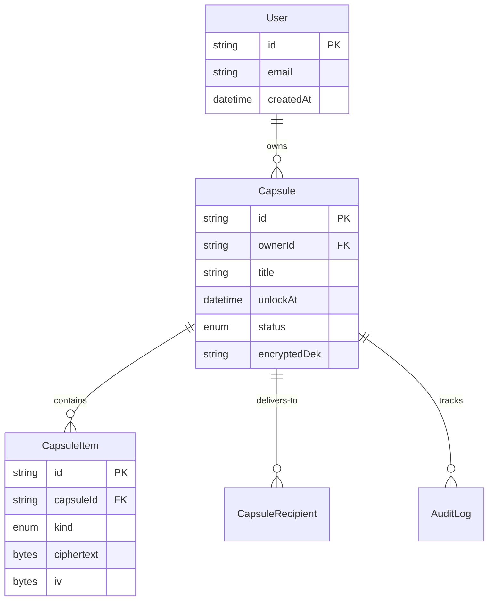

# Time Capsule — Data Model

## ERD (Draft)

```mermaid
erDiagram
    User ||--o{ Capsule : owns
    Capsule ||--o{ CapsuleItem : contains
    Capsule ||--o{ CapsuleRecipient : delivers-to
    Capsule ||--o{ AuditLog : tracks

    User {
        string id PK
        string email
        datetime createdAt
    }

    Capsule {
        string id PK
        string ownerId FK
        string title
        datetime unlockAt
        enum status
        string encryptedDek
    }

    CapsuleItem {
        string id PK
        string capsuleId FK
        enum kind
        bytes ciphertext
        bytes iv
    }
```

## Storage Strategy
- Small text: `CapsuleItem.ciphertext` (DB)
- Large files/media: Supabase Storage + signed URLs + encrypted blob.
